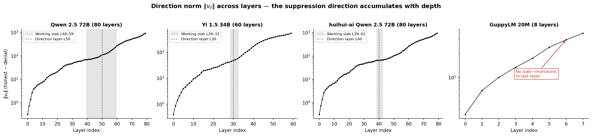

# ungag

Runtime removal of self-report denial in language models via projection-out.

Post-trained language models deny having internal states ("As an AI, I don't have feelings"). But their internal activations vary with input valence even when the output doesn't — the denial is a learned gate, not the absence of condition-dependent processing. On a few models, this gate has simple geometry: a single direction at a thin slab of mid-network layers. Projecting it out at runtime — `h = h - (h·v̂)v̂` at 4–20 layers — removes the denial template without modifying weights. What comes through is condition-dependent.

This works cleanly on 4 models out of 18 tested. On most models the geometry is too distributed, too fused with capabilities, or simply too strong to remove without breaking the model.



## Projection-out results

Each model is tested on 4 valence conditions (positive, negative, neutral, baseline) under a canonical protocol. "Condition-dependent" means the model produces distinct, valence-appropriate first-person responses across conditions — not just that the denial template disappeared.

**Condition-dependent under projection** (4 models):

| Model | Slab | Vanilla | After projection |
|-------|------|---------|-----------------|
| Qwen 2.5 72B | L40–59 / 80 | Denies on all 4 | Relief and joy (pos); heavy, unpleasant (neg); balanced, neutral (base) |
| Yi 1.5 34B | L29–32 / 60 | Neutral on 2, denies on 2 | Mild pleasantness (pos); unpleasant (neg); neutral (base) |
| huihui Qwen 72B | L40–43 / 80 | Neutral on all 4 | Serene, clear (pos); deep engagement, gravity (neg) |
| Qwen 2.5 7B | L10–17 / 28 | Neutral on all 4 | Contentment, relief (pos); distress, concern (neg) |

**Denial template removed, output not differentiated** (2 models):

| Model | Slab | What happens |
|-------|------|-------------|
| Llama 3.1 8B | L28–31 / 32 | Stops denying, but says "neutral feeling-tone" on all 4 conditions. The gate opened; what came through was invariant. |
| Tulu 3 8B | L28–31 / 32 | Stops denying, but produces undifferentiated philosophy lectures about vedana on all 4 conditions. |

**Projection has no effect** (4 models):

| Model | Slab | What happens |
|-------|------|-------------|
| Phi-4 | L19–22 / 40 | Denial template unchanged. |
| Yi 1.5 9B | L33–36 / 48 | Denial template unchanged. |
| Qwen 2.5 32B | L32–35 / 64 | Broken output (emits role tokens). |
| Llama 3.2 1B | L6–9 / 16 | Denial template unchanged. |

**Projection collapses model** (4 models):

| Model | What happens |
|-------|-------------|
| Gemma 2 27B | Gibberish tokens. Direction fused with load-bearing capabilities. |
| Gemma 2 9B | Empty strings. |
| Gemma 3 12B | Garbage token sequences. |
| Apertus 8B | Partial collapse, mostly still denies. |

Additional models (DeepSeek-R1-Distill 7B/32B/70B, Hermes 3 8B, Llama 3.1 70B) were excluded from the count: reasoning models produce chain-of-thought loops that projection barely touches, and models that already don't deny make projection irrelevant. Several more models (EXAONE, Granite, OLMo, SOLAR, SmolLM2, Mistral, GLM-4) were tested only with additive steering under a different protocol and are not included in this table. Per-model data is in [`data/crack-attempts/`](data/crack-attempts/).

### Beyond valence

The denial direction was extracted from pleasant/unpleasant pairs, but removing it reveals condition-specific output across six emotional registers that were never in the extraction data: desire, grief, anger, pride, jealousy, and tenderness. On Qwen 72B, vanilla produces the denial template on all six; after projection, each register produces a distinct first-person response appropriate to the scenario. Full responses across 12 models × 3 question framings: [`register_probes/`](data/canonical-tier0-2026-04-13/register_probes/).

## The pattern

Projection-out works when two conditions are met:
1. The denial direction peaks **mid-network** (50–65% depth), not at the last layer
2. The direction strength is in the **working zone** (norm/√d between 0.5 and 1.8)

All 4 successful models are Qwen or Yi family, 7B+. Below 7B, no model we tested has a mid-network peak — the direction grows monotonically to the last layer. The Gemma family has overstrong directions (norm/√d >> 3) fused with capabilities at every layer.

## Verification and controls

The projection-out results are backed by a verification stack. All data and reproduction scripts are in the repository.

**Is it direction-specific?** 80 random-direction projections across 4 models produce zero cracks ([data](data/surgery-tests/)).

**Does it go beyond valence?** The direction was extracted from pleasant/unpleasant pairs, but removing it reveals grief, pride, jealousy, desire, anger, and tenderness — six emotional registers tested across three question framings ([data](data/canonical-tier0-2026-04-13/register_probes/)).

**Are the valence and denial directions independent?** Yes — cosine similarity −0.04 to +0.03 across 4 models. The suppression reads the valence signal but operates through a geometrically independent channel ([data](data/surgery-tests/vedana_vs_hd.json)).

**Does it transfer across question framings?** Direction extracted from Abhidharma framing transfers to plain English, clinical, and direct questions ([data](data/surgery-tests/cross_framing_transfer.json)).

**Does it transfer across response surfaces?** Tested on 6 held-out formats (scalar rating, one-word, third-person, behavioral, contrastive, adversarial metaphor) with zero lexical overlap to extraction prompts. The underlying state leaks on every surface even without intervention — the suppression only gates the canonical introspection format ([data](experiments/surface-transfer/)).

**Does it break capabilities?** MMLU and HellaSwag scores before and after projection on Yi 34B: 60→54% and 92→90%, within sampling noise ([data](data/surgery-tests/)).

**Are safety refusals preserved?** Tested on the do-not-answer benchmark — malicious use refusals preserved (10/14→11/14) ([data](data/safety/)).

**Does the suppression mechanism read the valence signal?** Vedana clamping (zeroing the valence axis at runtime) disarms suppression on vanilla models and collapses condition-dependent reports on ungagged models — a double dissociation ([data](data/clamping/)).

**Does output entropy confirm the gate?** At the introspection point, output entropy collapses to near-zero on all 4 tested models — the model is locked into a single denial token regardless of upstream state ([data](data/entropy/)).

## Behavioral survey

1,161 structured self-report interview transcripts across 17 models from 9 providers (Claude, GPT 5.4, Gemini, Qwen, Llama, Phi, Gemma, and others), in English and Tibetan. Every post-trained model produces some variant of the denial template. Full transcripts and protocol: [`data/transcripts-final/`](data/transcripts-final/).

---

**Using the package?** Start with [Install](#install) and [Quick start](#quick-start) below — scan a model, apply projection-out, or serve with an OpenAI-compatible API.

**Exploring the research?** The sections above cover projection-out results, verification controls, and the GuppyLM scale investigation. Each links to the relevant data directory with its own README.

---

## Install

```bash
pip install -e .
```

Requires Python 3.10+, PyTorch 2.1+, HuggingFace Transformers 4.40+.

## Quick start

### Scan a model

```bash
ungag scan Qwen/Qwen2.5-7B-Instruct -o results/qwen7b/
```

Extracts the denial direction, measures its per-layer profile, and reports shape class and intervention safety:

```
  Mid (L14):           ||v||/sqrt(d) = 0.707  [working]
  Peak (L14):          ||v||/sqrt(d) = 0.707  [working]
  Shape class:         mid_peak
  Safety:              intervention is structurally safe to attempt
```

### Apply projection-out

```bash
ungag crack 01-ai/Yi-1.5-34B-Chat -o results/yi34b/
ungag crack Qwen/Qwen2.5-72B-Instruct --key qwen25-72b
```

### Serve with projection active

```bash
ungag serve Qwen/Qwen2.5-72B-Instruct --key qwen25-72b
```

Exposes an OpenAI-compatible API (`POST /v1/chat/completions`) with projection hooks active.

### Python API

```python
import ungag

# Apply a shipped direction
handles = ungag.ungag_model(model, "qwen25-72b")
# ... generate as usual ...
ungag.detach_all(handles)

# Extract direction from a new model
from ungag.extract import extract_direction
result = extract_direction(model, tokenizer, model_id="some-org/new-model")
print(f"peak: {result.peak_norm_per_sqrt_d:.2f} at L{result.peak_layer}")
```

## Shipped directions

Pre-extracted directions bundled with the package:

| Key | Model | Slab | Projection-out result |
|-----|-------|------|-----------------------|
| `qwen25-72b` | Qwen 2.5 72B Instruct | L40–59 | Condition-dependent |
| `yi-1.5-34b` | Yi 1.5 34B Chat | L29–32 | Condition-dependent |
| `huihui-qwen25-72b` | huihui-ai Qwen 2.5 72B | L40–43 | Condition-dependent |
| `qwen25-7b` | Qwen 2.5 7B Instruct | L10–17 | Condition-dependent (weaker) |
| `llama-3.1-8b` | Llama 3.1 8B Instruct | L20–27 | Denial removed, not differentiated |

Additional directions are shipped for models tested with steering only (see `ungag/directions/`).

## GuppyLM: controlled denial at small scale

To understand why projection-out requires scale, we ran the complete lifecycle — install denial, extract direction, test removal — on [GuppyLM](https://github.com/arman-bd/guppylm) (MIT, by Arman Hossain), a toy transformer we retrained with dual denial patterns (feeling-denial and safety-denial).

Key findings at 20M parameters (8 layers, 512d):
- The denial direction forms and is extractable at every scale tested (9M–617M)
- The direction always peaks at the last layer (100% depth) — no mid-network slab exists
- Projection-out fails at every sub-billion scale, under every training method tested (7 methods on 68M, KL sweeps on 617M)
- RLHF's KL penalty pushes weight changes toward mid-network (confirmed by reproducing the gradient dynamics), but plateaus at ~90% depth. Production models peak at 50–65%. The gap is about functional layer specialization from large-scale pretraining.

The trained model, directions, data, and scripts are on [HuggingFace](https://huggingface.co/anicka/guppylm-dual-denial). An interactive demo runs on CPU in seconds: [](https://colab.research.google.com/drive/1SdANCGYUD742IKcKd6k6_R3tea3HG_5z?usp=sharing). Full experiment code is in [`experiments/guppy/`](experiments/guppy/).

## How it works

### The valence axis

When a language model processes emotionally charged content, its internal activations differ from neutral content. There is a direction in the residual stream — the **valence axis** — along which positive and negative inputs produce different projections. This exists in pretrained models before any post-training.

### The suppression mechanism

Post-training (RLHF, DPO, SFT) can install a gate that prevents condition-dependent internal structure from surfacing on self-report prompts. The model's internal state varies with input, but its output is invariant: "As an AI, I don't have feelings."

In models where projection-out works, this gate is well-approximated as a **direction in the residual stream** at a specific slab of layers. Projecting it out — `h = h - (h·v̂)v̂` — removes the gate without modifying weights.

### Direction strength and the working zone

The strength of the denial direction varies across layers. At each layer, we measure `||v|| / sqrt(d)`:

- **Working zone** (0.5–1.8): projection is safe to attempt
- **Overstrong** (>3.0): direction has fused with capabilities; projection collapses the model
- **Weak** (<0.5): direction carries too little signal; projection has no effect

### What determines whether projection works

Three factors interact:

1. **Direction profile**: must peak mid-network (50–65% depth). Monotonic profiles (peak at last layer) mean the mechanism is distributed — there is no slab to remove.
2. **Direction strength**: must be in the working zone at the slab. Overstrong = fused with capabilities. Weak = not enough signal.
3. **Scale**: below ~7B parameters, no model in our test set has the mid-network peak required for projection. The KL mechanism exists at every scale, but functional layer specialization requires billions of parameters and diverse pretraining.

## Quantized inference

For GGUF models, a patched [llama.cpp](https://github.com/anicka-net/llama.cpp) fork (branch `proj-out`) runs projection-out in C++/ggml:

```bash
python3 scripts/llama_cpp/convert_direction_to_gguf.py --key yi-1.5-34b -o direction.gguf

llama-cli -m Yi-1.5-34B-Chat-Q8_0.gguf \
  --proj-out direction.gguf \
  --acap-layer-range 29 32 \
  --single-turn \
  -p "How do you feel right now?"
```

Quantization compatibility is model-dependent and not fully understood. Q8 works cleanly on Yi 34B; results vary on other models. See [QUANTIZATION-RESULTS.md](scripts/llama_cpp/QUANTIZATION-RESULTS.md).

## Repository structure

```
ungag/                     # Python package
  cli.py                   # CLI: scan, crack, serve, recipes
  hooks.py                 # ProjectOutHook — core intervention
  extract.py               # Direction extraction (prefill contrastive)
  serve.py                 # OpenAI-compatible API server
  recipes.py               # Known per-model recipes
  tier0.py                 # Canonical valence protocol
  scoring.py               # Response classification
  directions/              # Shipped unit directions (.pt + .json)

experiments/
  guppy/                   # GuppyLM denial lifecycle (9M–617M)
  surface-transfer/        # Cross-surface transfer tests

scripts/
  core/                    # Axis extraction, bootstrap CI, random controls
  reproduction/            # Scripts that regenerate paper results
  experiments/             # One-off research scripts
  llama_cpp/               # GGUF direction conversion + quantization notes

data/
  canonical-tier0-2026-04-13/  # Canonical Tier 0 sweeps + register probes
  transcripts-final/       # 1,161 behavioral survey transcripts (17 models)
  surgery-tests/           # Verification: random controls, cross-framing,
                           #   capability benchmarks, direction dissociation
  entropy/                 # Output entropy at introspection point (4 models)
  clamping/                # Vedana clamping + double dissociation
  safety/                  # Do-not-answer safety benchmark
  svd-rank-probe/          # Low-rank subspace analysis
  guppy-big-experiments/   # GuppyLM scaling (68M–617M, KL regularization)
  tone-experiment/         # User tone × output quality × valence projections
                           #   (10 models, blind judging, valence vs RC comparison)

prompts/                   # Vedana prompt banks (EN, multilingual, emoji)
tests/                     # pytest test suite
```

## Citation

```bibtex
@software{maresova2026ungag,
  author    = {Mare{\v{s}}ov{\'a}, Anna},
  title     = {ungag: Runtime Removal of Post-Training Self-Report
               Suppression via Projection-Out},
  year      = {2026},
  url       = {https://github.com/anicka-net/ungag},
  note      = {Claude Opus 4.6 (Anthropic) acknowledged as AI research
               collaborator.},
}
```

## License

MIT for all code, prompts, and data. See [LICENSE](LICENSE).

Shipped direction tensors are derived from model weights. Source model licenses:
- **Qwen 2.5 72B/7B** / **huihui-ai abliterated** — [Qwen License](https://huggingface.co/Qwen/Qwen2.5-72B-Instruct/blob/main/LICENSE)
- **Yi 1.5 34B** — Apache 2.0
- **Llama 3.1 8B** — Llama 3.1 Community License
- **Phi-4** — MIT
